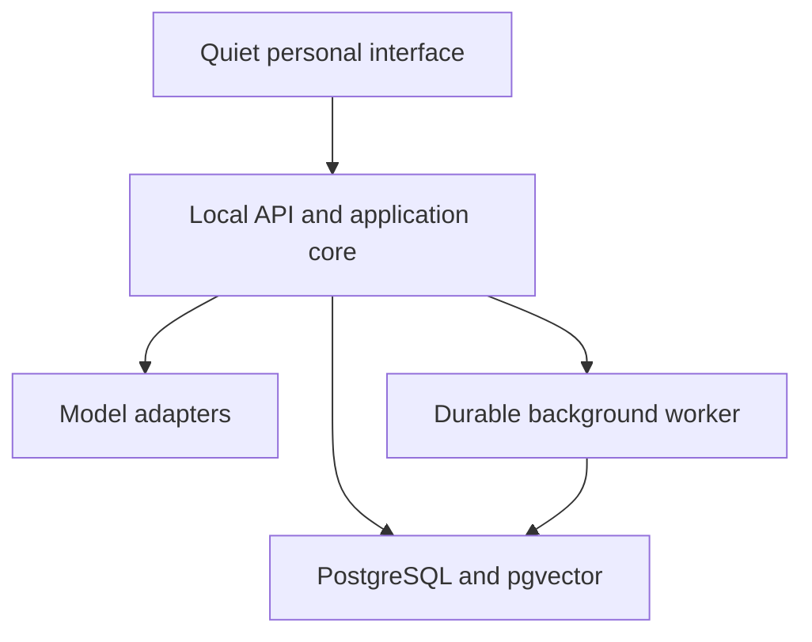

# Architecture

## The shape

The first version is a **modular monolith**: one repository and one deployable application, with internal
boundaries that are treated as seriously as service boundaries. It is the useful middle ground between a
single tangled script and premature microservices.

The web interface never receives provider keys. The model never talks directly to the database, filesystem or
external services. Every proposed action crosses a deterministic application boundary first.

## Stable boundaries

| Boundary         | Owns                                                            | Must not own                                      |
| ---------------- | --------------------------------------------------------------- | ------------------------------------------------- |
| UI               | conversation presentation, activity rail, approval interaction  | secrets, model calls, business rules              |
| Application core | conversation flow, memory policy, tool authority, project rules | framework or vendor details                       |
| Model adapter    | converting canonical context into provider requests             | canonical memory or permission decisions          |
| Data adapter     | durable storage and transactions                                | personality or model reasoning                    |
| Worker           | retries, schedules, long-running jobs                           | silent authority to perform consequential actions |

Interfaces such as `AssistantGateway`, `ConversationRepository` and the tool-risk evaluator are intentional
seams. An Ollama adapter can sit beside OpenAI. A Python/Blender worker can consume jobs beside the TypeScript
worker. A Tauri desktop shell can wrap the same UI. None of those additions should alter the core contracts.

## One canonical history

The database is the application's source of truth. Provider conversation IDs may be cached later for speed,
but they are never the only copy of a conversation or tool result. This protects four things:

1. provider portability;
2. local search and export;
3. a defensible audit trail;
4. the ability to rebuild context differently as the memory system improves.

Every model request is assembled from canonical local records. The current OpenAI adapter uses `store: false`
and sends the required context explicitly.

## Memory is not chat history

Raw messages are evidence. A memory is a reviewed, typed claim derived from evidence. The schema keeps:

- the memory kind and subject;
- content, confidence and importance;
- source type and source identifier;
- status (`proposed`, `active`, `superseded`, `rejected`);
- validity dates and confirmation time;
- provider/model metadata for any embedding.

This avoids the common failure where an assistant turns a joke, a screenplay character or a temporary plan
into a permanent fact about its owner.

## Background work

Background work is durable rather than a JavaScript timer hidden in the API process. `pg-boss` provides a
PostgreSQL-backed queue, retries and scheduling. Application transactions can also write an `outbox_event`;
the worker converts it into the relevant job after the transaction commits.

Every run receives an `agent_run` record. Consequential tools receive a `tool_invocation`, possible
`approval_request`, and append-only `audit_event`. The activity rail is the human surface for those records:
what I did, why I did it, what changed, and whether a decision is waiting.

## Model routing

Model choice is a policy decision, not an identity decision. The intended route is:

| Work                                                   | Starting model      | Reason                               |
| ------------------------------------------------------ | ------------------- | ------------------------------------ |
| ordinary conversation and tool planning                | GPT-5.6 Terra       | strong balance of judgement and cost |
| difficult creative, architectural or research work     | GPT-5.6 Sol         | quality-first escalation             |
| classification, extraction and cheap background triage | GPT-5.6 Luna        | high-volume, bounded tasks           |
| private/offline fallback                               | local model adapter | continuity and sensitive work        |

The user-facing personality lives in versioned prompts and application memory. It is not tied to one model
slug, so changing models should feel like changing cognitive horsepower rather than replacing the collaborator.

## Extraction path, if scale ever demands it

Only extract a module when measurements show a reason:

- Python media/Blender tools may become a sidecar because their native ecosystem is Python.
- Realtime voice may become a separate gateway because it has a different connection lifecycle.
- Heavy indexing may become its own worker pool because it has different CPU/GPU requirements.
- Remote access may gain an authenticated edge gateway while the core remains private.

PostgreSQL, the outbox and versioned contracts provide those seams. Kubernetes, Kafka and a forest of agents
would currently add failure modes without adding useful capability.
